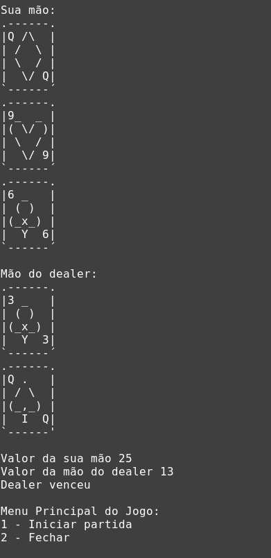

# Blackjack

**Disciplina**: FGA0210 - PARADIGMAS DE PROGRAMAÇÃO - T01 <br>
**Nro do Grupo**: G5<br>
**Paradigma**: Funcional<br>

## Alunos
|Matrícula|Aluno                                   |
|---------|----------------------------------------|
|18/0011961|Aline Helena Lermen                     |
|17/0006328|Ariel Vieira Lima Serafim               |
|19/0056843|Carlos Eduardo de Sousa Fiuza           |
|17/0139981|Danillo Gonçalves de Souza              |
|17/0010341|Gabriel Davi Silva Pereira              |
|18/0122606|Isadora da Cruz Galvão dos Santos Soares|
|17/0069800|Ithalo Luiz de Azevedo Mendes           |
|17/0145514|Iuri de Souza Severo Alves              |
|17/0164411|Victor Amaral Cerqueira                 |

## Sobre 
Descreva o seu projeto em linhas gerais. 

## Screenshots

- Iniciando Jogo


- Finaizando jogo



## Instalação 
**Linguagens**: Haskell<br>
**Tecnologias**: GHCI<br>

- Instalar GHC para seu computador.
- Rodar o seguinte comando dentro da pasta `src`.

```
ghc --make -o menu menu.hs -o blackjack blackjack.hs
```

- Executar o binario `blackjack` gerado.

## Uso 
Explique como usar seu projeto, caso haja algum passo a passo após o comando de execução.

## Vídeo
Adicione 1 ou mais vídeos com a execução do projeto.

## Fontes

- [Função de embaralhar](https://wiki.haskell.org/Random_shuffle) 
